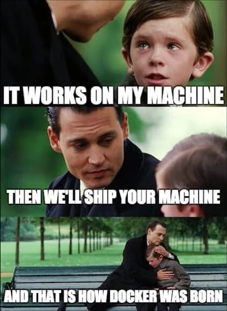

# B3 Docker Avancé

Sur ce dépôt git vous trouverez tous les cours/TP sur le cours de Docker avancé, 2024-2025

# [TP](./tp/README.md)

- [**TP1** : Docker ez oupa](./tp/1/README.md)
- [**TP2** : Construction avancée d'images](./tp/2/README.md)
- [**TP3** : Docker et CI/CD](./tp/3/README.md)

# Mémos

- [CLI Docker](./memo/docker_cli.md)

