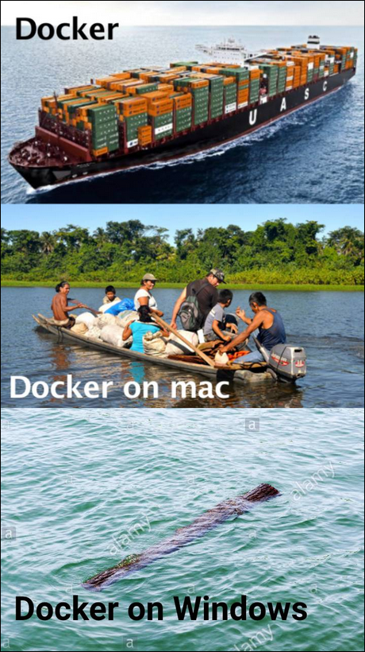

# TP1 : Docker ez oupa

Dans ce TP on va (ré)appréhender les bases de Docker.

Bon c'est une techno fondamentalement une Linux, si vous avez une VM ou Linux sur votre poste c'est un plus. Sinon, y'a aussi Docker for Windows, et un truc sur Mac, ça fera le taf !

## Sommaire

- [TP1 : Docker ez oupa](#tp1--docker-ez-oupa)
  - [Sommaire](#sommaire)
- [0. Setup](#0-setup)
- [Part I : Init](#part-i--init)
- [Part II : Images](#part-ii--images)
- [Part III. Compose](#part-iii-compose)

# 0. Setup

➜ **Munissez-vous du [mémo Docker](../../cours/memo/docker.md)**

# [Part I : Init](./part1.md)

Partie tranquilou avec au programme : **installation de Docker** sur votre poste, et vous faites **quelques lancements de conteneurs** depuis le terminal avec `docker run`.

Le but étant de prendre vos marques tranquillement avec l'utilisation de Docker sur votre poste si c'est pas déjà fait.

➜ [**Première partie ici.**](./part1.md)

# [Part II : Images](./part2.md)

Dans cette deuxième partie, on va s'attarder sur le *build* d'image custom. **Faire en sorte de packager notre code dans une image toute fraîche.**

Y'a juste à avoir Docker installé, on run l'image, et ça tourne ! **No dépendances** (à part Docker).

➜ [**Deuxième partie, on build.**](./part2.md)

# [Part III. Compose](./part3.md)

Pour la fin de ce TP on va manipuler un peu `docker compose`.

C'est vitre **très très chiant** de lancer plein de conteneurs manuellement (avec `docker run` ou une UI) dès qu'on a des conteneurs qui dépendent d'autres.

Genre une app et sa db comme ma `meow-api`. **Pour éviter ça, on peut utiliser `docker compose` qui permet de lancer plusieurs conteneurs en même temps.**

➜ [**Dernière partie sur `compose` iciii.**](./part3.md)

