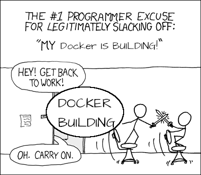
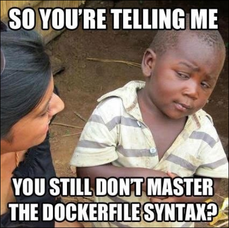

# Part II : Images

Dans cette deuxième partie, on va s'attarder sur le *build* d'image custom. **Faire en sorte de packager notre code dans une image toute fraîche.**

Y'a juste à avoir Docker installé, on run l'image, et ça tourne ! **No dépendances** (à part Docker).



## Index

- [Part II : Images](#part-ii--images)
  - [Index](#index)
- [I. Images publiques](#i-images-publiques)
- [II. Construire une image](#ii-construire-une-image)
  - [A. Build la meow-api](#a-build-la-meow-api)
  - [B. Packagez vous-même une app](#b-packagez-vous-même-une-app)
  - [C. Ecrire votre propre Dockerfile](#c-ecrire-votre-propre-dockerfile)

# I. Images publiques

🌞 **Récupérez des images**

- avec la commande `docker pull`
- récupérez :
  - l'image `python` officielle en version 3.11 (`python:3.11` pour la dernière version)
  - l'image `mysql` officielle en version 8.0.42
  - l'image `wordpress` officielle en dernière version
    - c'est le tag `:latest` pour récupérer la dernière version
    - si aucun tag n'est précisé, `:latest` est automatiquement ajouté
  - l'image `linuxserver/wikijs` en dernière version
    - ce n'est pas une image officielle car elle est hébergée par l'utilisateur `linuxserver` contrairement aux 3 précédentes
    - on doit donc avoir un moins haut niveau de confiance en cette image
- listez les images que vous avez sur la machine avec une commande `docker`

> Quand on tape `docker pull python` par exemple, un certain nombre de choses est implicite dans la commande. Les images, sauf si on précise autre chose, sont téléchargées depuis [le Docker Hub](https://hub.docker.com/). Rendez-vous avec un navigateur sur le Docker Hub pour voir la liste des tags disponibles pour une image donnée. Sachez qu'il existe d'autres répertoires publics d'images comme le Docker Hub, et qu'on peut facilement héberger le nôtre. C'est souvent le cas en entreprise. **On appelle ça un "registre d'images"**.

🌞 **Lancez un conteneur à partir de l'image Python**

- lancez un terminal `bash` ou `sh` à l'intérieur du conteneur
- vérifiez que la commande `python` est installée dans le conteneur, à la bonne version

> *Sympa d'installer Python dans une version spéficique en une commande non ? Peu importe que Python soit déjà installé sur le système ou pas. Puis on détruit le conteneur si on en a plus besoin.*

# II. Construire une image

Pour construire une image il faut :

- créer un fichier `Dockerfile`
- exécuter une commande `docker build` pour produire une image à partir du `Dockerfile`

## A. Build la meow-api

Dans ce repo git vous avez le [code](./app/app.py) et le fichier `Dockerfile` qui sert à *build* une image Docker.

🌞 **Récupérer le code et le `Dockerfile` sur votre machine**

- vrai tech le fait avec une commande et la met dans le compte-rendu
- créer un dossier et déplacer dedans le fichier de code et le `Dockerfile`

🌞 **Build une image `meow-api`**

- depuis un terminal, déplacez-vous dans le dossier qui contient le `Dockerfile`
- exécutez la commande :

```bash
# le caractère . fait référence au dossier actuel : le contexte de build
# -t permet de préciser un "tag" : le nom de l'image
docker build . -t meow-api
```

> Le build devrait être super rapide puisque vous avez déjà cette image. Docker ne stocke jamais deux fois la même chose.

🌞 **Afficher la liste des images dispos sur votre machine**

- dans la sortie de la commande, on devrait voir `meow-api` que vous venez de build

🌞 **Run cette image**

- faites un `docker run` qui lance l'image nouvellement build

## B. Packagez vous-même une app

Voilà un bout de code Python tout naze :

```python
import emoji

print(emoji.emojize("Cet exemple d'application est vraiment naze :thumbs_down:"))
```

🌞 **Ecrire un `Dockerfile` pour packager ce code**

- inspirez-vous de la structure de mon [`app/`](./app/) et du [`Dockerfile`](./app/Dockerfile) qu'il contient
- réservez encore un nouveau dossier sur votre machine pour stocker le code et son `Dockerfile`

🌞 **Build l'image**

- déplace-toi dans ton répertoire 
- `docker build . -t python_app:version_de_ouf`


🌞 **Proof !**

- une fois le build terminé, constater que l'image est dispo avec une commande `docker`

🌞 **Lancer l'image**

- lance l'image avec `docker run` :

```bash
docker run python_app:version_de_ouf
```

## C. Ecrire votre propre Dockerfile



➜ **Pour cette partie, récupérer un bout de code à vous**

- de préférence un service HTTP, un front web ou une API, peu importe
- t'as bien un truc qui traîne, un exo tout simple d'un autre cours ou quoi
- un truc standalone : qui a pas besoin de db ou quoi

🌞 **Ecrire un Dockerfile pour packager votre application**, il contient notamment :

- **`FROM`** : doit partir d'une image officielle
- **`COPY`** : ajoute le code dans l'image
- **`CMD`** : définit la commande à lancer quand le conteneur démarre

🌞 **Publiez votre image sur le Docker Hub**

- faut se créer un compte sur la WebUi du Docker Hub
- faut créer un *repository* depuis la WebUi, une fois connecté
- faut nommer correctement votre image, avec votre user dedans
  - genre moi c'était `it4lik/meow-api`
- et `docker push`
- dans le compte-rendu je veux :
  - toutes les commandes que vous avez tapées
  - l'URL de votre image sur la WebUI du Docker Hub
