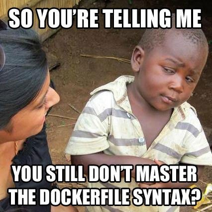

# TP2 : Construction avancée d'images

Dans ce TP2 on va aborder plusieurs notions autour des *images* de conteneurisation.

Le but de ce TP est donc de voir comment construire de **meilleures images**.

**C koa "meilleures" ?** TRES BONNE QUESTION :

- **la perf**
  - au moment du build
  - au moment du lancement
  - pendant que le conteneur tourne
- **la sécu**
  - notion de confiance
  - utilisateur applicatif
- un peu d'**efficience** que diable !
  - économie de stockage
  - réduction des temps de build
  - efficacité pendant le dév
- une **vraie portabilité**
  - comme ils disent : "write once, deploy anywhere !"

> Y'a pas mal de bonnes pratiques que je vous recommande dans ce TP qui sont **des conséquences directes de la méthodologie [Twelve-factor app](https://12factor.net/).** Une méthodo proposée y'a plus de 10 ans, et qui reste toujours d'actualité pour coder apps orientées micro-services, mais en vrai, c'est juste fabrique des apps modulaires, autonomes, secure by design, facilement portables et déployables, ce genre de choses (un micro-service quoi).

# Index

- [TP2 : Construction avancée d'images](#tp2--construction-avancée-dimages)
- [Index](#index)
- [Prérequis](#prérequis)
- [Part I : Packaging basique](#part-i--packaging-basique)
- [Part II : Des environnements différents](#part-ii--des-environnements-différents)
- [Part III : Base image](#part-iii--base-image)
- [Part IV : En vrac](#part-iv--en-vrac)

# Prérequis

➜ **Docker installé sur votre poste**

➜ **Une application à vous**

- idéalement, l'app que vous rendez pour votre projet
- un peu moins idéalement, une app qui expose un front HTTP (API, front page, anything)
- presque pas idéalement, une app qui repose sur un service-tiers (genre une db SQL)

➜ **Un dépôt git dédié à ce TP**

- ouais j'ai changé d'avis, ça va beaucoup mieux s'y prêter
- vous pouvez `git push` tout de suite le code de votre app dans un sous-dossier `src` de ce dépôt

➜ **Pour le rendu**

- le dépôt git suffit
- le `README.md` contient vos commandes nécessaires à la réalisation des étapes demandées (quand un 🌞 te fait taper des commandes, tu me les mets !)
- inutile d'écrire un truc dans le `README.md` quand vous modifiez juste du code ou des fichiers Docker (`Dockerfile` et `docker-compose.yml` essentiellement)

# [Part I : Packaging basique](./part1.md)

**Une première partie où on va `docker build` une image qui nous servira tout le long du TP.**

L'idée va être de packager dans une *image* le code de votre projet.

Y'aura plus qu'à lancer cette *image* pour lancer cette application.

**Vous devrez aussi rédiger un `docker-compose.yml`**

Si votre code a besoin de services annexes pour fonctionner (database, proxy, etc.), vous rédigerez un `docker-compose.yml` qui allume tout le nécessaire.

Le but : on a juste à `docker compose up` pour lancer votre projet : aucune dépendance à installer sur la machine ! (à part Docker évidemment)

➜ [**Part I** : Packaging basique](./part1.md)

# [Part II : Des environnements différents](./part2.md)

**On utilise généralement pas tout à fait nos *images* de la même façon en dév ou en prod.**

**En dév**, on veut pouvoir `docker run` notre code, et facilement le modifier sans avoir à rebuild à chaque fois. On essaie d'aller vers le truc le plus flexible.

**En revanche, en prod**, c'est l'exact inverse : on veut que le code soit harcodé dans l'image. On essaie vers le truc le plus immuable, stable, prévisible et prédictible.

➜ [**Part II** : Des environnements différents](./part2.md)

# [Part III : Base image](./part3.md)

Dans cette partie on s'attarder un peu sur **le choix de l'image de base.**

**Donc se concentrer sur les premières lignes du `Dockerfile`, en particulier le `FROM`.**

➜ [**Part III** : Base image](./part3.md)

# [Part IV : En vrac](./part4.md)

Quelques derniers axes d'améliorations en vrac, qui avaient pas leur place dans une autre partie, et qui sont trop courts pour que je leur en réserve une.

➜ [**Part IV** : En vrac](./part4.md)
