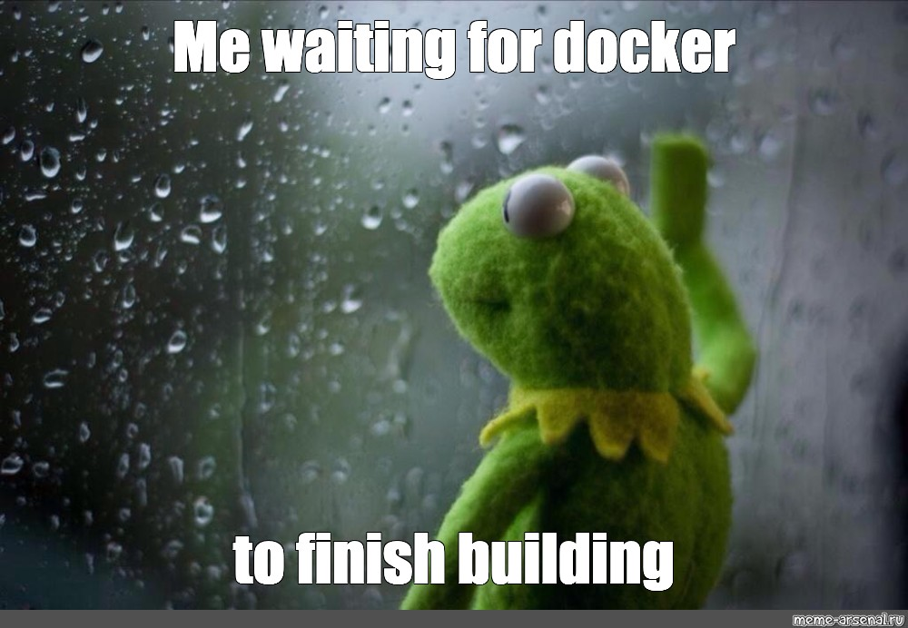

# Part I : Packaging basique

**Une première partie où on va `docker build` une image qui nous servira tout le long du TP.**

L'idée va être de packager dans une *image* le code de votre projet.

Y'aura plus qu'à lancer cette *image* pour lancer cette application.

**Vous devrez aussi rédiger un `docker-compose.yml`**

Si votre code a besoin de services annexes pour fonctionner (database, proxy, etc.), vous rédigerez un `docker-compose.yml` qui allume tout le nécessaire.

Le but : on a juste à `docker compose up` pour lancer votre projet : aucune dépendance à installer sur la machine ! (à part Docker évidemment)

## Index

- [Part I : Packaging basique](#part-i--packaging-basique)
  - [Index](#index)
  - [1. Les tâches](#1-les-tâches)
  - [2. Test](#2-test)

## 1. Les tâches

➜ **Ecrire un `Dockerfile`**

- il doit partir d'une image officielle (dépôt *library* sur le Docker Hub)
- contient votre code dans `/app`
- définit le `WORKDIR` sur `/app`
- contient les dépendances de votre code
  - le langage
  - les libs
- quand on `docker run` cette image, votre code est lancé 
  - avec `CMD` ou `ENTRYPOINT`

➜ **Ecrire un `docker-compose.yml`**

- lance l'*image* qui a été build juste au dessus
  - utilisation d'un partage de port pour que l'app soit accessible
  - contient une instruction `build` : l'*image* est automatiquement build à partir du `Dockerfile`
  - partage de port pour accéder à l'application
- lance d'autres conteneurs si nécessaire
  - proxy, db, etc, n'importe quel service dont a besoin votre app
  - des images officielles (pas de `Dockerfile` à rédiger)
- si l'un des conteneurs contient des données persistentes, vous utilisez un volume nommé (TODO : define named volume)
  - par exemple, pour conserver les données de votre database à travers les redémarrages/updates !

➜ **Ajuster votre code ?**

- le port et l'adresse IP d'écoute de votre service HTTP doivent être lues dans variables d'environnement
  - `LISTEN_PORT` pour le port
  - `LISTEN_IP` pour l'adresse IP
- si vous utilisez une db ou autre service
  - vous devez gérer **au moins** l'adresse IP/le nom auquel vous vous connectez avec une variable d'environnement
- les variables ne sont pas chargées depuis un `.env` dans votre code
  - elles seront définies dans le conteneur en permanence

➜ **Structure du repo attendue**

```bash
❯ tree -a -L2
.
├── docker-compose.yml
├── Dockerfile
├── .env.sample        # exemple de .env avec des valeurs placeholder
├── .gitignore         # ignore au moins votre .env réel
├── README.md          # votre compte-rendu de TP
├── requirements.txt   # fichier de dépendances à la racine
└── src                # tout votre code doit être là-dedans
    └── main.py        # évidemment un autre nom suivant votre langage
```



## 2. Test

🌞 **Test !**

- un `docker compose up` dans le compte-rendu
  - il build à la volée votre image
  - ajoutez `--build` si nécessaire
- suivi d'un `curl` qui prouve que le service fonctionne

---

➜ [**Hop, un lien vers la partie 2**](./part2.md)
