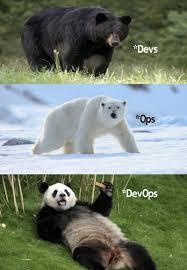
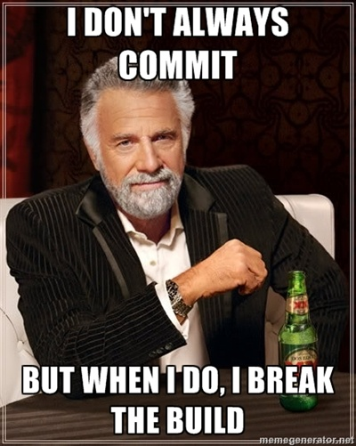

# Part 1 : Première pipeline

Dans cette première partie, on met en place une première pipeline de CI.

Au menu : on va utiliser **Gitlab** pour **lancer des tâches automatiquement** à chaque push sur un repo.

Pour bosser, **vous continuez sur le dépôt git du TP2**, y'a tout ce qu'il nous faut dessus.



Allez, notre première *pipeline*. C'est un mot générique pour désigner un truc à exécuter automatiquement dans un dépôt git.

On va donc créer notre première *pipeline* avec GitLab : **en créant un fichier `gitlab-ci.yml` à la racine du dépôt git.**

Une *pipeline* Gitlab est composée de plusieurs *stages*. Chaque *stage* consiste en une série de *job*. Chaque *job* est une commande ou une suite de commande à exécuter dans un environnement précis.

> Vous allez voir, ça va prendre du sens au fur et à mesure du TP, on va poncer ces concepts !

➜ **Ajoutez un fichier `gitlab-ci.yml` à la racine de votre dépôt Gitlab**

- il doit contenir ça :

```yml
image: debian:latest

stages:
  - meow

meow-job:
  stage: meow
  before_script:
    - apt-get update -qq
    - apt-get install -y cowsay
  script:
    - /usr/games/cowsay "Meoooow"
```

🌞 **`add`, `commit`, `push`**

- pour ajouter le fichier `gitlab-ci.yml` au dépôt
- un message de commit psa tout pourri encore svp :ddd



➜ **RDV sur la WebUI de GitLab**

- allez sur la page principale de votre repo Gitlab, et vérifiez que vous voyez bien le fichier `.gitlab-ci.yml`
- toujours depuis la page de votre repo Gitlab, depuis le menu latéral, allez dans la section `Build`
- vous devriez voir votre *job* en cours d'exécution, vous pouvez avoir l'output du test

> Le *job* a été exécuté sur un *Gitlab Runner*, qui a lancé un conteneur éphémère (avec Docker) pour exécuter le code demandé. Vous pouvez consulter l'output console du *job* depuis la WebUI, et vous pourrez voir que la première étape avant d'exécuter notre *job* c'est de cloner le dépôt git à l'intérieur du conteneur éphémère. Beh ui, comme ça il peut faire des tests dessus !

⚠️⚠️⚠️ **Ne continuez pas tant que vous n'avez pas vu votre *job* s'exécuter et vous devriez pouvoir voir l'output du test. Donc tu continues pas tant que t'as pas vu une vache miauler**

```
 _________
< Meoooow >
 ---------
        \   ^__^
         \  (oo)\_______
            (__)\       )\/\
                ||----w |
                ||     ||
```

## Go next

👉 [**Gogogo partie 2 : Test then Build**](./part2.md)

