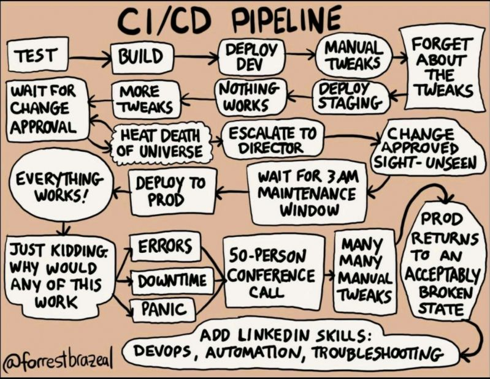

# Part 2 : Test then Build

On continue avec **les premiers morceaux d'une chaîne d'automatisation clean**. Une partie dédiée à **la CI**.

> *CI* pour *Continuous Integration* (ou *Intégration Continue*) : le fait d'effectuer des actions automatiques à chaque push sur un dépôt git.

On effectue des **tests automatiquement** sur le code, et on **refuse le push si les tests ne sont pas validés**.

Si les tests sont validés, on déclenche un **build automatique du code**. Ici, on déclenchera le build d'une image Docker.

## Index

- [Part 2 : Test then Build](#part-2--test-then-build)
  - [Index](#index)
  - [1. Linting](#1-linting)
    - [A. Intro](#a-intro)
    - [B. Lint me baby](#b-lint-me-baby)
    - [C. Format me baby](#c-format-me-baby)
  - [2. Building](#2-building)
  - [3. Publishing](#3-publishing)
  - [4. Some manual tests](#4-some-manual-tests)
  - [Next next next](#next-next-next)

## 1. Linting

### A. Intro

Le *linting* c'est le fait de vérifier qu'un code donné est conforme aux bonnes pratiques. Le *linting* est donc spécifique au langage qui est utilisé.

Généralement, les outils de *linting* se contentent de lever des alertes, en nous indiquant en quoi le code analysé n'est pas conforme aux bonnes pratiques.

Ici on parle uniquement de bonnes pratiques d'écriture de code, il n'y aucune notion de sécurité.

Ici, on va appliquer du *linting* sur vos fichiers de code. 

Beaucoup de ces outils sont des outils CLI, on les lance depuis un terminal. Idéal pour l'intégrer à autre chose, comme un script ou une pipeline de CI !

> Par exemple, pour Python il existe le standard PEP qui répertorie une tonne de bonnes pratiques. Les *linters* Python vérifient notamment la conformité avec ce standard.

### B. Lint me baby

➜ **Choisissez un (ou plusieurs) *linter(s)***

- y'en a plein, faites vos ptites recherches pour ceux qui vous concernent
- choisissez au moins un pour votre principal langage

> Y'a aussi des *linters* pour le `json` ou n'importe quel autre type de fichier répandu.

🌞 **Installez le *linter* sur votre poste**

- essayez de le lancer en local depuis votre terminal sur votre code
- pour voir un peu comment s'utilise l'outil !

🌞 **Ajoutez l'exécution automatique du *linter* à chaque `git push`**

- modifiez votre `gitlab-ci.yml`
- ajoutez un *stage* `lint`
  - il utilise une image Docker de votre choix
    - qui contient déjà votre *linter*
    - OU qui l'installe au début du *stage* (forcément plus lent)
  - il exécute une commande pour *lint* le code
- faites un `git push` et vérifier que :
  - votre job dans le *stage* `lint` a bien été effectué
  - il a refusé le *push* car le code est pourri

⚠️⚠️⚠️ **N'essayez pas de suite de passer le *linter*, go sur la partie d'après d'abord !**

➜ **HINT :** n'hésitez pas à commenter des *jobs* dans votre `.gitlab-ci.yml` pour éviter d'attendre la full pipeline à chaque fois. [On peut aussi "cacher" le job, en le préfixant par un `.`.](https://docs.gitlab.com/ci/jobs/#hide-jobs). On peut aussi [définir des *jobs* comme non-bloquants](https://docs.gitlab.com/ci/yaml/#allow_failure) : même s'il fail, la pipeline continue (par défaut, si un job fail, la pipeline ne continue pas).

### C. Format me baby

Bon on va pas se taper toutes les erreurs de *lint* à la main hein.

➜ **Choisissez un *formatter* pour votre langage**

- pareil y'en a plusieurs, faites vos recherches
- en Python, je sais que [`black`](https://github.com/psf/black) est une référence

🌞 **Installez le *formatter* sur votre poste**

- exécutez le *formatter* sur votre code
- normalement le *linter* ne devrait ~presque~ plus crier

🌞 **Armés de votre *formatter* et votre gro cervo faites un push qui passe**

- donc vous utilisez le *formatter*
- ptet fix quelques lignes de code à la mano pour que ça match ce qui est demandé par le *linter*
- faites un `git push` qui passe les tests du stage `lint`

> Bon on peut en discuter longuement, mais non, on met pas le *formatter* directement dans la *pipeline de CI/CD*. On parle d'un truc qui ré-écrit votre code, en plus conforme aux bones pratiques. Ok c'est stylé et désirable, mais on parle d'un truc qui **MODIFIE** votre code. Il est pas censé modifier la façon dont le code fonctionne (généralement basé sur l'AST du langage, il est conservé après *formatting*), juste comment il est écrit, mais le mot le plus important de cette phrase c'est "censé". But we never know. So don't do it kids.

## 2. Building

Okayyyy donc on a notre premier vrai test sur le code. On passe à l'étape suivante qu'on retrouve dans toute *pipeline CI/CD* digne de ce nom : le build automatisé !

On va donc ajouter un *stage* `build` à notre fichier  `gitlab-ci.yml` qui déclenche un `docker build` automatiquement.

🌞 **Modifiez votre `.gitlab-ci.yml`**

- ajoutez un nouveau stage `build`
- il doit exécuter un `docker build` pour déclencher automatiquement un `build` du `Dockerfile`
- je vous invite fort à vous documenter en ligne pour ça :
  - pour rappel, chaque *job* est lancé dans un conteneur éphémère par Gitlab
  - là on parle d'un *job* qui tape des commandes `docker`
  - donc utiliser `docker` depuis l'intérieur d'un conteneur ?
  - documentez-vous comment on fait ça clean avec Gitlab, c'est un use-case super répandu/basique !

➜ **HINT :** n'hésitez pas à commenter des jobs dans votre `.gitlab-ci.yml` pour éviter d'attendre la full pipeline à chaque fois. [On peut aussi "cacher" le job, en le préfixant par un `.`.](https://docs.gitlab.com/ci/jobs/#hide-jobs)

## 3. Publishing

Okay c'est cool de build, mais ça serait bien que ça serve à quelque chose et pas juste pour le plaisir de build un machin :d

On va donc finir par automatiquement `push` l'image Docker sur un *registre Docker*, afin de pouvoir ensuite la récupérer sur une autre machine, et la lancer.

Gitlab embarque un *registre Docker* qui est privé, pour chaque dépôt git que l'on crée. Pour avoir les droits de `push` dessus, il faut y être autorisé. Vous devrez donc utiliser une commande `docker login` dans votre pipeline, avant de `docker push` sur le registre privé.

Il faudra aussi correctement nommer votre image pour qu'elle soit push sur le registre privé. Gitlab fournit beaucoup de variables natives pour ne pas avoir à connaître ces infos et les réutiliser facilement.

Documentez-vous, vous trouverez plein d'exemples tout prêts tout chauds sur internet !

---

🌞 **Modifiez votre `.gitlab-ci.yml`**

- ajoutez un nouveau stage `publish`
- il exécute une commande `docker push`
- deux images doivent être produites :
  - `<TON_APP>:<COMMIT_ID>` (nouvelle image unique à chaque déroulement de pipeline)
  - `<TON_APP>:latest` (mise à jour à chaque déroulement de pipeline)
- je vous laisse faire un peu de recherches ou de Gepetto pour build/push depuis votre pipeline, c'est un grand classique !

➜ **Une fois que l'image a été *push*, elle est visible sur la WebUI de GitLab**

- rendez-vous sur la page principale de votre dépôt
- dans le menu latéral : `Deploy > Container Registry`

## 4. Some manual tests

Maintenant que l'image est publiée sur le registre Gitlab, elle est récupérable depuis n'importe quelle machine qui a un accès internet.

> Vous pouvez le faire sur votre poste, une VM, peu importe. On veut juste vérifier qu'on peut pull/run l'image correctement.

🌞 **Récupérer l'image**

- faites un `docker pull <IMAGE_NAME>` : récupération de l'image

> Vous pourrez voir le nom de l'image depuis la Webui, toujours au même endroit : `Deploy > Container Registry`

🌞 **Modifier les `docker-compose.yml`**

- l'image qu'ils utilisent pour votre code doit être celle du registre Gitlab

🌞 **Lancer l'application**

- un `docker compose up`

🌞 **Does it work ?**

- un `curl` local pour vérifier que l'app fonctionne

## Next next next

👉 Ca commence à ressembler à un truc ! On continue avec [**du déploiement continue dans la partie 3**](./part3.md).

